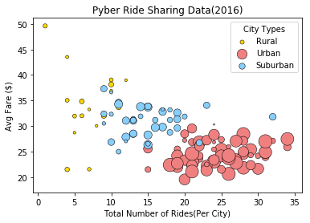
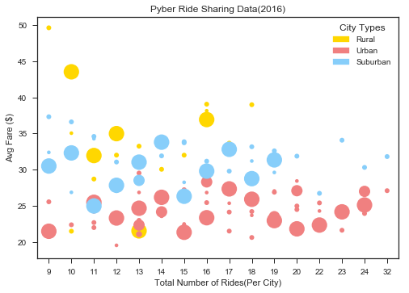
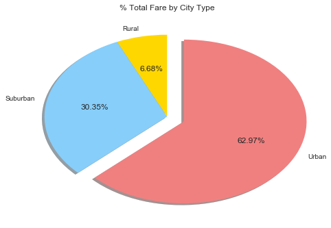
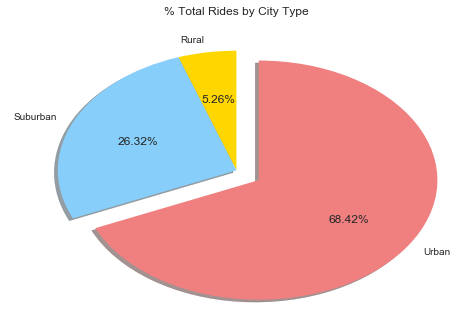
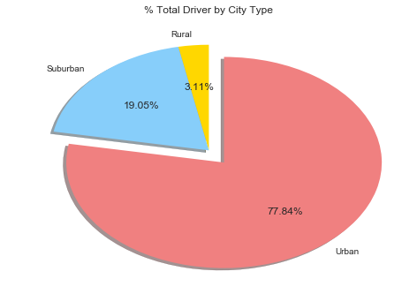

```python
import pandas as pd
import numpy as np
import matplotlib.pyplot as plt


file1 = './Resources/city_data.csv'
city_df = pd.read_csv(file1)
city_df.head()


```


<div>
<style>
    .dataframe thead tr:only-child th {
        text-align: right;
    }

    .dataframe thead th {
        text-align: left;
    }

    .dataframe tbody tr th {
        vertical-align: top;
    }
</style>
<table border="1" class="dataframe">
  <thead>
    <tr style="text-align: right;">
      <th></th>
      <th>city</th>
      <th>driver_count</th>
      <th>type</th>
    </tr>
  </thead>
  <tbody>
    <tr>
      <th>0</th>
      <td>Kelseyland</td>
      <td>63</td>
      <td>Urban</td>
    </tr>
    <tr>
      <th>1</th>
      <td>Nguyenbury</td>
      <td>8</td>
      <td>Urban</td>
    </tr>
    <tr>
      <th>2</th>
      <td>East Douglas</td>
      <td>12</td>
      <td>Urban</td>
    </tr>
    <tr>
      <th>3</th>
      <td>West Dawnfurt</td>
      <td>34</td>
      <td>Urban</td>
    </tr>
    <tr>
      <th>4</th>
      <td>Rodriguezburgh</td>
      <td>52</td>
      <td>Urban</td>
    </tr>
  </tbody>
</table>
</div>


```python
file2 = './Resources/ride_data.csv'
ride_df = pd.read_csv(file2)
ride_df.head()
```


<div>
<style>
    .dataframe thead tr:only-child th {
        text-align: right;
    }

    .dataframe thead th {
        text-align: left;
    }

    .dataframe tbody tr th {
        vertical-align: top;
    }
</style>
<table border="1" class="dataframe">
  <thead>
    <tr style="text-align: right;">
      <th></th>
      <th>city</th>
      <th>date</th>
      <th>fare</th>
      <th>ride_id</th>
    </tr>
  </thead>
  <tbody>
    <tr>
      <th>0</th>
      <td>Sarabury</td>
      <td>2016-01-16 13:49:27</td>
      <td>38.35</td>
      <td>5403689035038</td>
    </tr>
    <tr>
      <th>1</th>
      <td>South Roy</td>
      <td>2016-01-02 18:42:34</td>
      <td>17.49</td>
      <td>4036272335942</td>
    </tr>
    <tr>
      <th>2</th>
      <td>Wiseborough</td>
      <td>2016-01-21 17:35:29</td>
      <td>44.18</td>
      <td>3645042422587</td>
    </tr>
    <tr>
      <th>3</th>
      <td>Spencertown</td>
      <td>2016-07-31 14:53:22</td>
      <td>6.87</td>
      <td>2242596575892</td>
    </tr>
    <tr>
      <th>4</th>
      <td>Nguyenbury</td>
      <td>2016-07-09 04:42:44</td>
      <td>6.28</td>
      <td>1543057793673</td>
    </tr>
  </tbody>
</table>
</div>


```python
city_grpbycity=city_df.groupby(["city","type"],as_index=False)
city_citysum_df=city_grpbycity.sum()
city_citysum_df.head()
```


<div>
<style>
    .dataframe thead tr:only-child th {
        text-align: right;
    }

    .dataframe thead th {
        text-align: left;
    }

    .dataframe tbody tr th {
        vertical-align: top;
    }
</style>
<table border="1" class="dataframe">
  <thead>
    <tr style="text-align: right;">
      <th></th>
      <th>city</th>
      <th>type</th>
      <th>driver_count</th>
    </tr>
  </thead>
  <tbody>
    <tr>
      <th>0</th>
      <td>Alvarezhaven</td>
      <td>Urban</td>
      <td>21</td>
    </tr>
    <tr>
      <th>1</th>
      <td>Alyssaberg</td>
      <td>Urban</td>
      <td>67</td>
    </tr>
    <tr>
      <th>2</th>
      <td>Anitamouth</td>
      <td>Suburban</td>
      <td>16</td>
    </tr>
    <tr>
      <th>3</th>
      <td>Antoniomouth</td>
      <td>Urban</td>
      <td>21</td>
    </tr>
    <tr>
      <th>4</th>
      <td>Aprilchester</td>
      <td>Urban</td>
      <td>49</td>
    </tr>
  </tbody>
</table>
</div>


```python
ride_grpbycity=ride_df.groupby(["city"],as_index=False)
ride_citycnt_df=ride_grpbycity.count()
ride_citycnt_df.drop(['date', 'fare'],axis=1,inplace=True)
ride_citycnt_df.rename(columns={"ride_id":"total_rides"},inplace=True)
ride_citycnt_df.head()
```


<div>
<style>
    .dataframe thead tr:only-child th {
        text-align: right;
    }

    .dataframe thead th {
        text-align: left;
    }

    .dataframe tbody tr th {
        vertical-align: top;
    }
</style>
<table border="1" class="dataframe">
  <thead>
    <tr style="text-align: right;">
      <th></th>
      <th>city</th>
      <th>total_rides</th>
    </tr>
  </thead>
  <tbody>
    <tr>
      <th>0</th>
      <td>Alvarezhaven</td>
      <td>31</td>
    </tr>
    <tr>
      <th>1</th>
      <td>Alyssaberg</td>
      <td>26</td>
    </tr>
    <tr>
      <th>2</th>
      <td>Anitamouth</td>
      <td>9</td>
    </tr>
    <tr>
      <th>3</th>
      <td>Antoniomouth</td>
      <td>22</td>
    </tr>
    <tr>
      <th>4</th>
      <td>Aprilchester</td>
      <td>19</td>
    </tr>
  </tbody>
</table>
</div>


```python
ride_citysum_df=ride_grpbycity.sum()
ride_citysum_df.drop(['ride_id'],axis=1,inplace=True)
ride_citysum_df.rename(columns={"fare":"total_fare"},inplace=True)
ride_citysum_df.head()
```


<div>
<style>
    .dataframe thead tr:only-child th {
        text-align: right;
    }

    .dataframe thead th {
        text-align: left;
    }

    .dataframe tbody tr th {
        vertical-align: top;
    }
</style>
<table border="1" class="dataframe">
  <thead>
    <tr style="text-align: right;">
      <th></th>
      <th>city</th>
      <th>total_fare</th>
    </tr>
  </thead>
  <tbody>
    <tr>
      <th>0</th>
      <td>Alvarezhaven</td>
      <td>741.79</td>
    </tr>
    <tr>
      <th>1</th>
      <td>Alyssaberg</td>
      <td>535.85</td>
    </tr>
    <tr>
      <th>2</th>
      <td>Anitamouth</td>
      <td>335.84</td>
    </tr>
    <tr>
      <th>3</th>
      <td>Antoniomouth</td>
      <td>519.75</td>
    </tr>
    <tr>
      <th>4</th>
      <td>Aprilchester</td>
      <td>417.65</td>
    </tr>
  </tbody>
</table>
</div>


```python
ride_cityavg_df=ride_grpbycity.mean()
ride_cityavg_df.drop(['ride_id'],axis=1,inplace=True)
ride_cityavg_df.rename(columns={"fare":"avg_city_fare"},inplace=True)
ride_cityavg_df.head()
```


<div>
<style>
    .dataframe thead tr:only-child th {
        text-align: right;
    }

    .dataframe thead th {
        text-align: left;
    }

    .dataframe tbody tr th {
        vertical-align: top;
    }
</style>
<table border="1" class="dataframe">
  <thead>
    <tr style="text-align: right;">
      <th></th>
      <th>city</th>
      <th>avg_city_fare</th>
    </tr>
  </thead>
  <tbody>
    <tr>
      <th>0</th>
      <td>Alvarezhaven</td>
      <td>23.928710</td>
    </tr>
    <tr>
      <th>1</th>
      <td>Alyssaberg</td>
      <td>20.609615</td>
    </tr>
    <tr>
      <th>2</th>
      <td>Anitamouth</td>
      <td>37.315556</td>
    </tr>
    <tr>
      <th>3</th>
      <td>Antoniomouth</td>
      <td>23.625000</td>
    </tr>
    <tr>
      <th>4</th>
      <td>Aprilchester</td>
      <td>21.981579</td>
    </tr>
  </tbody>
</table>
</div>


```python
ride_citymrg1_df=pd.merge(ride_citycnt_df, ride_citysum_df, on="city")
ride_citymrg_df=pd.merge(ride_citymrg1_df, ride_cityavg_df, on="city")
ride_citymrg_df.head()
```


<div>
<style>
    .dataframe thead tr:only-child th {
        text-align: right;
    }

    .dataframe thead th {
        text-align: left;
    }

    .dataframe tbody tr th {
        vertical-align: top;
    }
</style>
<table border="1" class="dataframe">
  <thead>
    <tr style="text-align: right;">
      <th></th>
      <th>city</th>
      <th>total_rides</th>
      <th>total_fare</th>
      <th>avg_city_fare</th>
    </tr>
  </thead>
  <tbody>
    <tr>
      <th>0</th>
      <td>Alvarezhaven</td>
      <td>31</td>
      <td>741.79</td>
      <td>23.928710</td>
    </tr>
    <tr>
      <th>1</th>
      <td>Alyssaberg</td>
      <td>26</td>
      <td>535.85</td>
      <td>20.609615</td>
    </tr>
    <tr>
      <th>2</th>
      <td>Anitamouth</td>
      <td>9</td>
      <td>335.84</td>
      <td>37.315556</td>
    </tr>
    <tr>
      <th>3</th>
      <td>Antoniomouth</td>
      <td>22</td>
      <td>519.75</td>
      <td>23.625000</td>
    </tr>
    <tr>
      <th>4</th>
      <td>Aprilchester</td>
      <td>19</td>
      <td>417.65</td>
      <td>21.981579</td>
    </tr>
  </tbody>
</table>
</div>


```python
main_mrg_df=pd.merge(city_citysum_df, ride_citymrg_df, on="city")
main_mrg_df.head()


```


<div>
<style>
    .dataframe thead tr:only-child th {
        text-align: right;
    }

    .dataframe thead th {
        text-align: left;
    }

    .dataframe tbody tr th {
        vertical-align: top;
    }
</style>
<table border="1" class="dataframe">
  <thead>
    <tr style="text-align: right;">
      <th></th>
      <th>city</th>
      <th>type</th>
      <th>driver_count</th>
      <th>total_rides</th>
      <th>total_fare</th>
      <th>avg_city_fare</th>
    </tr>
  </thead>
  <tbody>
    <tr>
      <th>0</th>
      <td>Alvarezhaven</td>
      <td>Urban</td>
      <td>21</td>
      <td>31</td>
      <td>741.79</td>
      <td>23.928710</td>
    </tr>
    <tr>
      <th>1</th>
      <td>Alyssaberg</td>
      <td>Urban</td>
      <td>67</td>
      <td>26</td>
      <td>535.85</td>
      <td>20.609615</td>
    </tr>
    <tr>
      <th>2</th>
      <td>Anitamouth</td>
      <td>Suburban</td>
      <td>16</td>
      <td>9</td>
      <td>335.84</td>
      <td>37.315556</td>
    </tr>
    <tr>
      <th>3</th>
      <td>Antoniomouth</td>
      <td>Urban</td>
      <td>21</td>
      <td>22</td>
      <td>519.75</td>
      <td>23.625000</td>
    </tr>
    <tr>
      <th>4</th>
      <td>Aprilchester</td>
      <td>Urban</td>
      <td>49</td>
      <td>19</td>
      <td>417.65</td>
      <td>21.981579</td>
    </tr>
  </tbody>
</table>
</div>


```python
plt.title("Pyber Ride Sharing Data(2016)")
plt.xlabel("Total Number of Rides(Per City)")
plt.ylabel("Avg Fare ($)")
plt.figsize=(6,5)

p_rural=plt.scatter(            
            main_mrg_df["total_rides"].loc[main_mrg_df["type"]=="Rural"],
            main_mrg_df["avg_city_fare"].loc[main_mrg_df["type"]=="Rural"],            
            s=main_mrg_df["driver_count"].loc[main_mrg_df["type"]=="Rural"]*4,
            c="gold",label="Rural",alpha=1,linewidths=.5,edgecolor="black")

p_urban=plt.scatter(
            main_mrg_df["total_rides"].loc[main_mrg_df["type"]=="Urban"],
            main_mrg_df["avg_city_fare"].loc[main_mrg_df["type"]=="Urban"],
            s=main_mrg_df["driver_count"].loc[main_mrg_df["type"]=="Urban"]*4,
            c="lightcoral",label="Urban",alpha=1,linewidths=.5,edgecolor="black")

p_subrbn=plt.scatter(     
            main_mrg_df["total_rides"].loc[main_mrg_df["type"]=="Suburban"],
            main_mrg_df["avg_city_fare"].loc[main_mrg_df["type"]=="Suburban"],
            s=main_mrg_df["driver_count"].loc[main_mrg_df["type"]=="Suburban"]*4,
            c="lightskyblue",label="Suburban",alpha=1,linewidths=.5,edgecolor="black")
plt.legend((p_rural,p_urban,p_subrbn),
           ("Rural","Urban","Suburban"),title="City Types")

##############################################
## Bubble - Solution 1A Using Scatter Plot  ##
##############################################

plt.show()
```





```python
import seaborn as sns
import matplotlib.patches as mpatches
sns.set_style("ticks")

```


```python
plt.title("Pyber Ride Sharing Data(2016)")
plt.xlabel("Total Number of Rides(Per City)")
plt.ylabel("Avg Fare ($)")

p_rural=sns.stripplot(x="total_rides", 
              y="avg_city_fare",
              data=main_mrg_df.loc[main_mrg_df["type"]=="Rural"],
              size=main_mrg_df["driver_count"]/3.5,
              linewidths=1,edgecolor="black",color="gold")

p_urban=sns.stripplot(x="total_rides", 
              y="avg_city_fare",
              data=main_mrg_df.loc[main_mrg_df["type"]=="Urban"],
              size=main_mrg_df["driver_count"]/3.5,
              linewidths=1,edgecolor="black",color="lightcoral")

p_subrbn=sns.stripplot(x="total_rides", 
              y="avg_city_fare",
              data=main_mrg_df.loc[main_mrg_df["type"]=="Suburban"],
              size=main_mrg_df["driver_count"]/3.5,
              linewidths=1,edgecolor="black",color="lightskyblue")


leg_rural = mpatches.Patch(color='gold', label='Rural')
plt.legend(handles=[leg_rural],title="City Type")

leg_urban = mpatches.Patch(color='lightcoral', label='Urban')
plt.legend(handles=[leg_urban],title="City Type")


leg_sub = mpatches.Patch(color='lightskyblue', label='Suburban')
plt.legend(handles=[leg_sub],title="City Type")

plt.legend((leg_rural,leg_urban,leg_sub),
           ("Rural","Urban","Suburban"),title="City Types")

p_rural.set(xlabel='Total Number of Rides(Per City)', ylabel='Avg Fare ($)')
p_urban.set(xlabel='Total Number of Rides(Per City)', ylabel='Avg Fare ($)')
p_subrbn.set(xlabel='Total Number of Rides(Per City)', ylabel='Avg Fare ($)')


##############################################
## Bubble - Solution 1B Using Seaborn Lib   ##
##############################################

sns.plt.show()
```





```python
main_grpbytype_df=main_mrg_df.groupby(["type"],as_index=False)
main_typesum_df=main_grpbytype_df.sum()
main_typesum_df.rename(columns={"driver_count":"total_drivers"},inplace=True)
main_typesum_df.head()
```


<div>
<style>
    .dataframe thead tr:only-child th {
        text-align: right;
    }

    .dataframe thead th {
        text-align: left;
    }

    .dataframe tbody tr th {
        vertical-align: top;
    }
</style>
<table border="1" class="dataframe">
  <thead>
    <tr style="text-align: right;">
      <th></th>
      <th>type</th>
      <th>total_drivers</th>
      <th>total_rides</th>
      <th>total_fare</th>
      <th>avg_city_fare</th>
    </tr>
  </thead>
  <tbody>
    <tr>
      <th>0</th>
      <td>Rural</td>
      <td>104</td>
      <td>125</td>
      <td>4255.09</td>
      <td>615.728572</td>
    </tr>
    <tr>
      <th>1</th>
      <td>Suburban</td>
      <td>638</td>
      <td>625</td>
      <td>19317.88</td>
      <td>1268.627391</td>
    </tr>
    <tr>
      <th>2</th>
      <td>Urban</td>
      <td>2607</td>
      <td>1625</td>
      <td>40078.34</td>
      <td>1623.863390</td>
    </tr>
  </tbody>
</table>
</div>


```python
main_typesum_df["pct_fare"]=(main_typesum_df["total_fare"]/main_typesum_df.sum()["total_fare"])*100
main_typesum_df["pct_rides"]=(main_typesum_df["total_rides"]/main_typesum_df.sum()["total_rides"])*100
main_typesum_df["pct_drivers"]=(main_typesum_df["total_drivers"]/main_typesum_df.sum()["total_drivers"])*100
main_typesum_df            
```


<div>
<style>
    .dataframe thead tr:only-child th {
        text-align: right;
    }

    .dataframe thead th {
        text-align: left;
    }

    .dataframe tbody tr th {
        vertical-align: top;
    }
</style>
<table border="1" class="dataframe">
  <thead>
    <tr style="text-align: right;">
      <th></th>
      <th>type</th>
      <th>total_drivers</th>
      <th>total_rides</th>
      <th>total_fare</th>
      <th>avg_city_fare</th>
      <th>pct_fare</th>
      <th>pct_rides</th>
      <th>pct_drivers</th>
    </tr>
  </thead>
  <tbody>
    <tr>
      <th>0</th>
      <td>Rural</td>
      <td>104</td>
      <td>125</td>
      <td>4255.09</td>
      <td>615.728572</td>
      <td>6.68500</td>
      <td>5.263158</td>
      <td>3.105405</td>
    </tr>
    <tr>
      <th>1</th>
      <td>Suburban</td>
      <td>638</td>
      <td>625</td>
      <td>19317.88</td>
      <td>1268.627391</td>
      <td>30.34954</td>
      <td>26.315789</td>
      <td>19.050463</td>
    </tr>
    <tr>
      <th>2</th>
      <td>Urban</td>
      <td>2607</td>
      <td>1625</td>
      <td>40078.34</td>
      <td>1623.863390</td>
      <td>62.96546</td>
      <td>68.421053</td>
      <td>77.844133</td>
    </tr>
  </tbody>
</table>
</div>


```python
plt.title("% Total Fare by City Type")
plt.pie(main_typesum_df["pct_fare"],labels=main_typesum_df["type"],colors=("gold","lightskyblue","lightcoral"),startangle=90,explode=(0, 0, 0.15),shadow=True,autopct='%1.2f%%')


plt.show()


```





```python
plt.title("% Total Rides by City Type")
plt.pie(main_typesum_df["pct_rides"],labels=main_typesum_df["type"],colors=("gold","lightskyblue","lightcoral"),startangle=90,explode=(0, 0, 0.15),shadow=True,autopct='%1.2f%%')
plt.show()
```





```python
plt.title("% Total Driver by City Type")
plt.pie(main_typesum_df["pct_drivers"],labels=main_typesum_df["type"],colors=("gold","lightskyblue","lightcoral"),startangle=90,explode=(0, 0, 0.15),shadow=True,autopct='%1.2f%%')
plt.show()
```





```python

```
